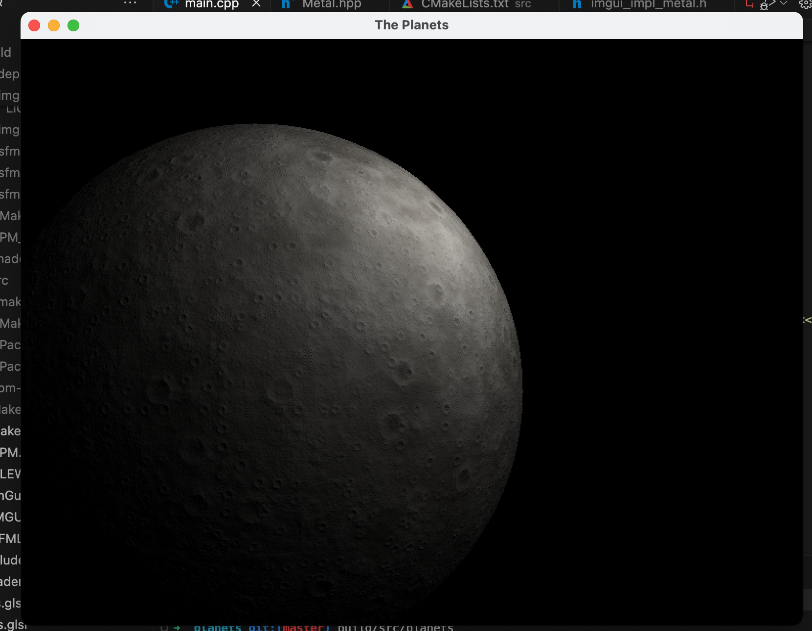

# Template For SFML
- cross-platform
- opens a bare minimum window



```
mkdir build
cmake ..
```
Unix:
```
make
```
Windows. Depending on your compiler. I'm using MinGW compiling 32-bit:
```
mingw32-make
```
